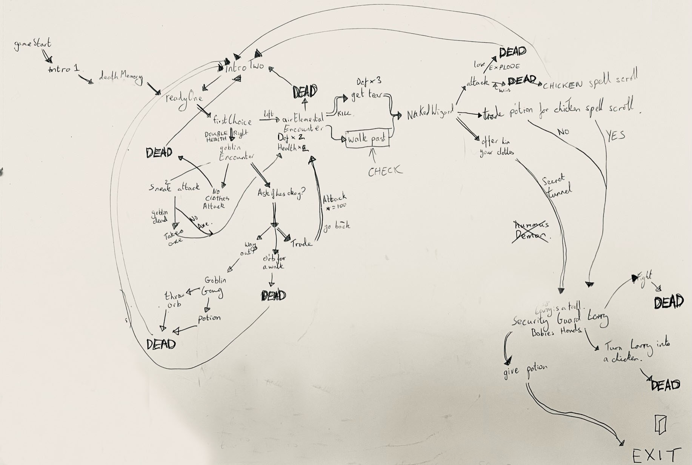
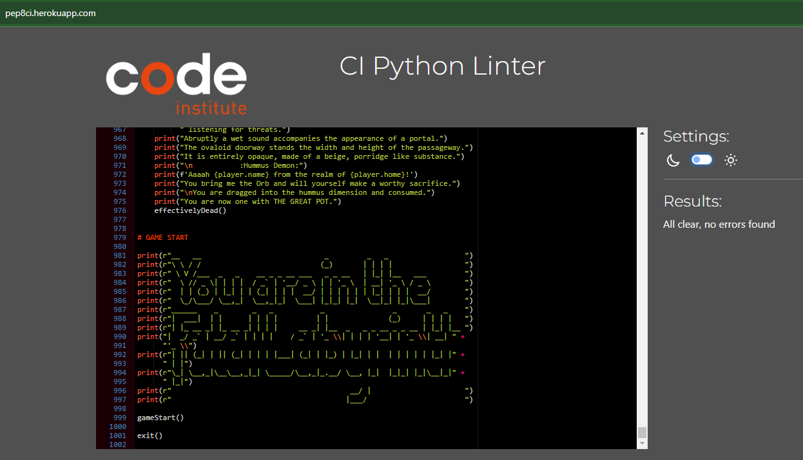

Fatal Labyrinth is a Python terminal game, a text adventure, which runs in the Code Institute mock terminal on Heroku.

Users can try to find their way through the labyrinth while avoiding the gruesome demise of their player character.

[Here is the live version of my project - enter at your peril](https://fatal-labyrinth-c541af595fbe.herokuapp.com/)

# Fatal Labyrinth - Text Adventure

## How to play

- Fatal Labyrinth is loosely based of the original Japanese Fatal Labyrinth game from 1990 but takes inspiration from tradional Dungeons & Dragons narratives and paperback choose your own adventure models.
- Much like the goosebumps books of the 90s you are told a story and then given choices to lead your character one way or another. By entering the number of the choice the story will follow your decision and change as you progress. 
- The choices you make effect your characters stats, these stats are edited by functions at each choice. So that choices made in different orders will produce differing results. 
- In the narrative world of Fatal Labyrinth unfortunetly death is an everyday occurence so the likelihood that your character survives to escape is extremely low, there may only be one correct route for you to leave with your life. So the game is designed to be played repeatedly in quick succession, the player learns form their mistakes and tries again. 
- Intro non-player characters can be told that you remember what happened moments before so they don't repeat the same information to you. It is assumed that the Ladyrinth has magically revived you at this previous point in time before your death so that you can repeat the torture of the Labyrinth again and again. 

- SPOILER: For the purposes of marking and avoiding confusion I have added the directions for how to clear the labyrinth at the bottom of this ReadMe so that examiners might navigate without aggrivation. The puzzle is designed to be challenging, there is a way out, but for those who prefer a hint, it is provided here. 

# Features

Character Stats
- Each character has stats which dictate how interactions play out.
- Stats are health, defense and attack.
- Defense blocks an attack and any remaining points are removed from health. If health reaches zero the character dies.
- Stats change based on the weapon they are carrying or on environmental effects

Inventory
- The player has an inventory which they can bring up at any time to check what they are carrying.
- Inventory is limited to a weapon, clothing and 2 items
- The presence of items in the inventory offers some options to be availble 

Input Validation
- This is essential in most games but particularly in Fatal Labyrinth
- All inputs are checked if they match decision variables
- If they do not a stock response from you companion, the Orb of Helping, will prompt the player to try again
- Some questions have easter egg responses to specific answers, for example telling the Orb that your name is Bob or Robert, ellicits a special response for that answer only.

## Future Features

Narrative
- Ideally the narrative would be longer, the game has several loops and forks but the options are endless. So future versions may have a lot more content to play through.
- Player verses environment choices.

Character
- The character has several features already but it would be fun to add futher details. A full set or itemised armour, a bag of supplies, food and drink etc.
- Adding more non-player characters to the game in future is a real possibility.

Responses
- More responses and options to dialogue.
- Information and secrets system. If you learn certain pieces of information it can unlock new responses further down the line

# Data Model

I decided to use the Character class as my model. Each character, both the player and the computer controlled non-player characters are instances of the Character class. Their attribute values are supplied from a google sheet so that they were easier to control and edit game dynamics as the project developed. 

The Character class stores stats, details and inventory. There are several functions which interact with the instances to change or display their attribute values. Such as the inventory method which prints the contents of the inventory to the player. 

## Testing

I have manually tested this project by:

- Passing the code through a PEP8 linter and confirmed there are no problems.
- Given invalid inputs; strings when numbers are expected, out of bounds inputs.
- I have tested every available choice with both variations of how a player may choose to write the answer in numbers or letters. 
- Play tested all the permutations which lead to an ending.
- Tested in my local terminal and the Code Institute Heroku terminal.
- Tested the Heroku terminal on multiple devices, inluding an iphone. 

# Bugs

## Solved Bugs

- There was an error while opening the relevant workspace on CodeAnywhere which left the workspace permanently in a state of "starting". So it could not be closed or opened. I created a new workspace, however this did not contain the updated GitIgnore file. When I pushed to GitHub the creds.json file was pushed to the public platform. This is not acceptable. I updated the GitIgnore file but creds.json remained in the commit history. After much research I discovered the "git reset --hard ~Head" command. Which steps back a commit and deletes the previous commit from the history once a force push is made. This cleared any sensitive data from GitHub and solved the issue.
- After leaving time for the now unconnected commit files to be deleted with the waste disposal sweep of GitHub it appeared the creds file would not be deleted. The only option was to delete that creds file from google cloud platform and generate a new creds file so that the exposed file no longer risked the security of any data. This was done and all security concerns were resolved.

- Editing the vertical ruler settings value to 80 allowed me to avoid the repeated error warnings for lines which were over 79 characters. 

## Remaining Bugs

- No bugs remaining

## Validator Testing

- PEP8
    - No errors were returned from PEP8online.com

## Deployment

This project was deployed using Code Institute's mock terminal for Heroku.
- Steps for deployment:
    - Fork or clone this repository
    - Create a new Heroku app
    - Set the buildpacks to Python and NodeJS in that order
    - Link the Heroku app to the repository
    - Click on Deploy

## Credits

- Code institute for the Deployment Terminal
- My fiance who left me to my work while she is 3 months pregnant with our first child.

## SPOILER

Fastest Route To the Finish

- n - Name (Bob is default)
- n - No memory
- y - yes ready
- r - right to sad goblin
- n - no do not duck below rune
- 1 - ask if he's okay
- 3 - trade for the axe
- y - yes trust the goblin
- y - yes fight the elemental
- y - yes keep going
- y - yes approach wizard
- 3 - gift the wizard clothes
- y - yes take tunnel
- y - yes tell Larry your name
- 2 - offer Larry potion

